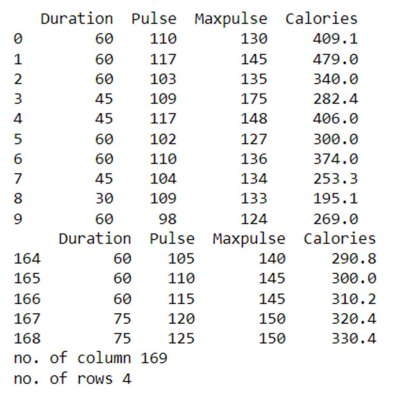

# Read-from-CSV

### AIM:
 To wite the python program to read the CSV 
file content. 
### ALGORITHM: 
### Step 1:
 Load the CSV into a data frame. 
### Step 2:
 Print the number of contents to be displayed using 
df.head(). 
### Step 3:
 The number of rows returned is defined in Pandas 
option settings. 
### Step 4:
 Check your systems maximum column with the 
pd.options.display.max_column statement. 
### Step 5:
 Increase the maximum number of rows to display the 
entire Dataframe. 


## PROGRAM:
```
import pandas as pd
df = pd.read_csv('data.csv')
print(df.head(10))
print(df.tail())
print("no. of column",len(df.axes[0]))
print("no. of rows",len(df.axes[1]))
```
## OUTPUT:

## RESULT:
Hence the program is executed successfully.